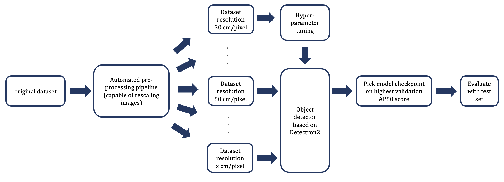
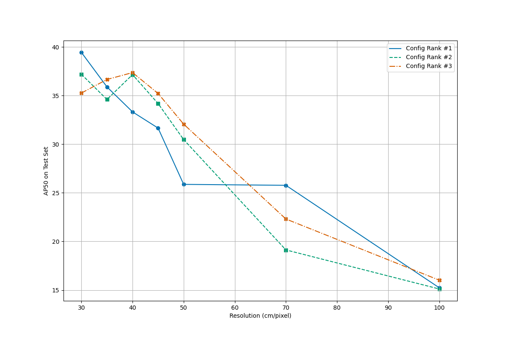
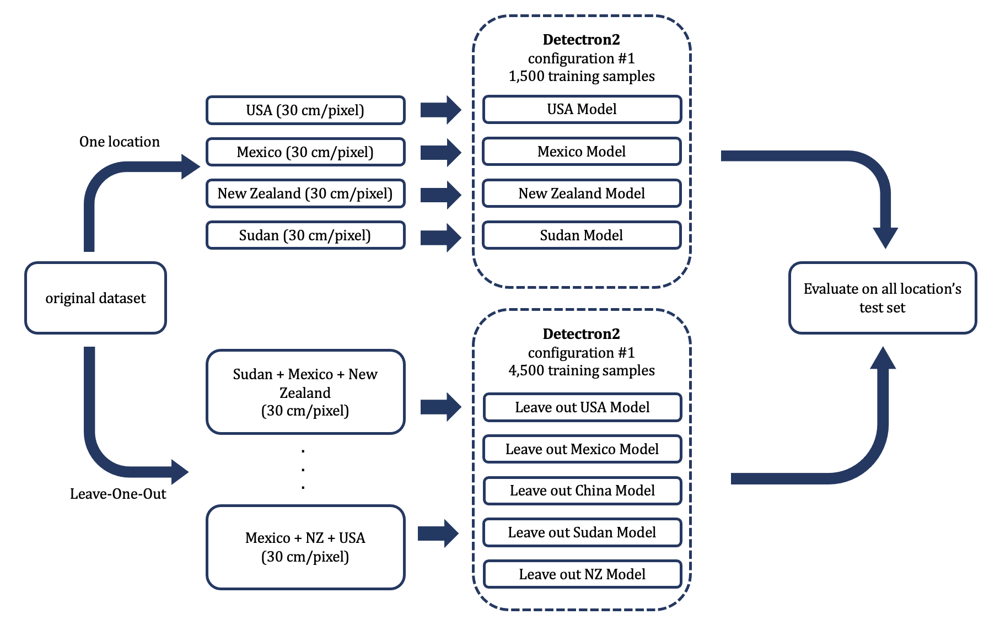
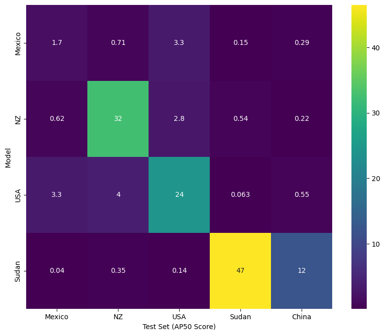
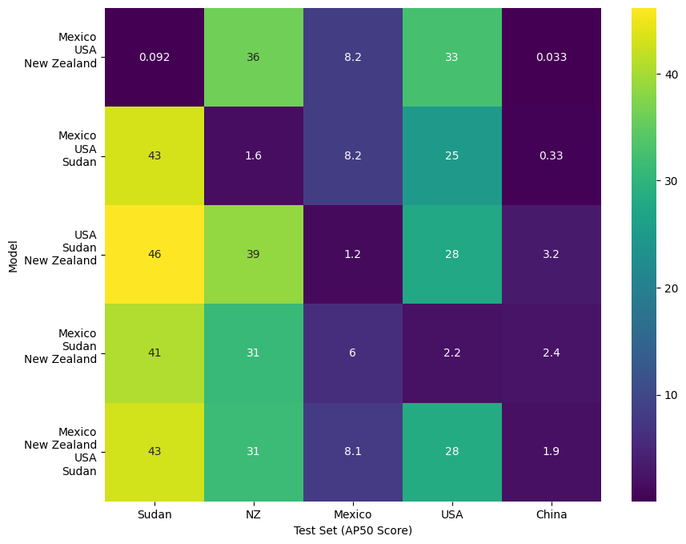
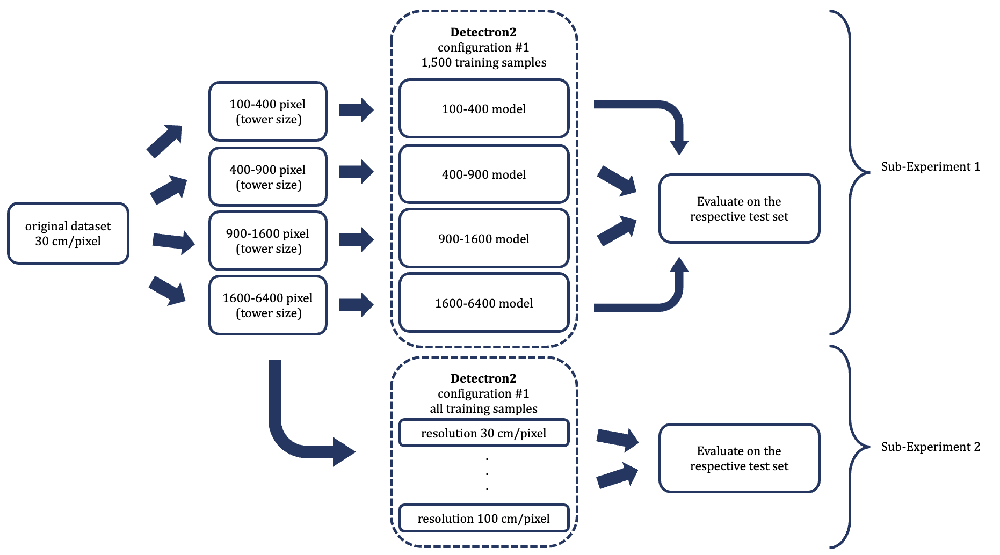
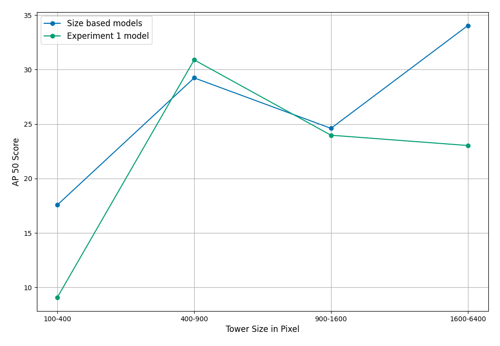
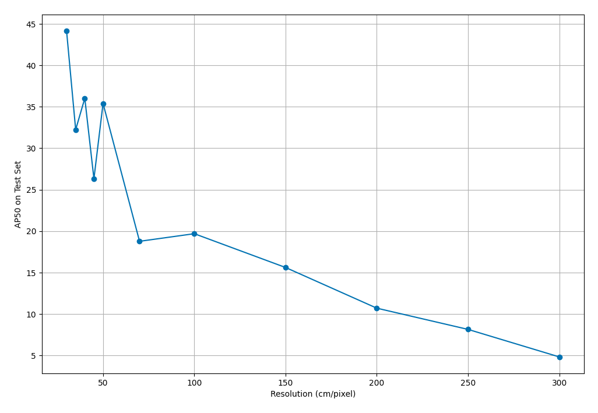

<b><a href="#summary">Summary</a></b>
|
<b><a href="#methodology">Methodology</a></b>
|
<b><a href="#experiments">Experiments</a></b>
|
<b><a href="#results & policy implications">Results & Policy Implications</a></b>

# The Impact of Image Resolution on Remote Sensing of Energy Infrastructure

This repository contains the notebooks and information on our Master Thesis research - ["The Impact of Image Resolution on Remote Sensing of Energy Infrastructure"](https://github.com/LINKTOPDF.pdf). It does not contain any model checkpoints or the data due to their size. If you are interested in any of these, just get in touch.

## Summary

Accurate data about the structure of the electricity grid is crucial for all stakeholders working on the Seventh Sustainable Development Goal which aims for clean and affordable energy for everyone, especially in developing countries. Conventional ways of collecting this data, mostly relying on manual work by humans, are cost-intensive, slow, and hard-to-scale. Meanwhile, recent advancements in deep learning models have enabled automated localisation and classification of objects in imagery, referred to as object detection. These models, such as \emph{Faster-RCNN}, have proven their capability to detect even small objects like solar panels or electricity towers in satellite imagery \citep{huang_gridtracer_2021}. However, it remains unclear to what extent the spatial resolution of these images affects the performance of such an object detection model, since earlier studies have always relied on satellite imagery with the highest, yet costly, available resolution of 30 cm/pixel. Therefore, in this work, we explore three questions: (1) How does a decrease in image resolution affect the ability of an object detection model to find distribution and transmission towers in satellite imagery, (2) what is the effect of changing the composition of geographies within the training set, and (3) how do differences in electricity tower sizes impact the detection performance? In our experiments we observe that the networks' precision deteriorates as we gradually decrease the resolution. When focusing on subsets of geographies we find, besides a high in-sample precision, that the inclusion of a variety of biotopes can lead to marginal improvements in the otherwise poor out-of-sample performance. Finally, the results suggest that the detection performance of the model, when specifically trained to detect larger towers, is more resilient to a decrease in resolution, even when size variance is high.

## Methodology

### Data

We employ the data used in [(Huang et al. 2021)](https://arxiv.org/abs/2101.06390), which is overhead imagery collected by drones and satellites. The images are taken in various locations across the world including New Zealand, the USA, China, Sudan, and Mexico. Within the respective countries, different locations are included. The dataset consists of 512 individual files that each contain some kind of electricity grid tower, either _Transmission_, _Distribution_, or _Other_ towers. In contrast to [(Huang et al. 2021)](https://arxiv.org/abs/2101.06390), who only use data from the US and New Zealand, we include all locations for which data is available at a resolution < 30 cm/pixel to ensure that our approach is applicable across various geographic locations. To ensure comparison with their results and to provide comparability between locations, all images are brought to a base resolution of 30 cm/pixel.

*Example Images from the dataset visualizing diverse locations and tower sizes*

Notebooks for data pre-processing:
- [Data Extraction](https://github.com/Hertie-Thesis-Halkenhaeusser-Rabe/Thesis-Code-Base/blob/main/scripts/01_Data_Extraction.ipynb)
- [Separation of Label Files](https://github.com/Hertie-Thesis-Halkenhaeusser-Rabe/Thesis-Code-Base/blob/main/scripts/03_Separate_Labels_Files.ipynb)

_Note: Parts of the data (for locations in the US and New Zealand) are publicly available [here.](https://figshare.com/articles/dataset/Electric_Transmission_Infrastructure_Satellite_Imagery_Dataset_for_Computer_Vision/14935434)_

### Downsampling

Downsampling as defined in this work is the decrease of spatial resolution as measured in centimetres per pixel at constant image size. Even though our dataset contains imagery at a resolution of 15 cm/pixel, we decided to use 30 cm/pixel as our base resolution as it is the highest resolution commercially available for the entire world and widely used in research on object detection in high-resolution overhead imagery. To keep our research relevant to practice we downsampled the image further to common resolutions of satellites: 30 cm/pixel, 50 cm/pixel, 70 cm/pixel, 100 cm/pixel.

To avoid aliasing artefacts in the downsampled images, which are common in simulated low-resolution imagery, we use an approach which additionally smoothes over the imagery with a Gaussian kernel and images are then downsampled using bilinear interpolation.

*Example image is downsampled from the 12 cm/pixel original resolution to 30 cm/pixel, 50 cm/pixel, 70 cm/pixel and 100 cm/pixel (left to right). Ground truth bounding boxes are shown for the two towers in the image*

The notebook for downsampling can be found [here.](https://github.com/Hertie-Thesis-Halkenhaeusser-Rabe/Thesis-Code-Base/blob/main/scripts/02_Downsampling.ipynb)

## Experiments

## Experiments

### Experiment 1

<b><a href=scripts/07_A_Experiment_1_5.ipynb>Training</a></b>
|
<b><a href=scripts/08_Training_Analysis.ipynb>Training Analysis</a></b>
|
<b><a href=scripts/09_Evaluate_on_test.ipynb>Test Results</a></b>

To investigate the impact of resolution on the capability to detect energy infrastructure using deep learning, we evaluate the performances of fine-tuned models on increasingly downsampled images of the same base data. 

Overall, the experiments yield strong evidence for a reduction in the detector's performance at lower levels of resolution. Nevertheless, the results are not conclusive enough to set a definitive threshold below which object detection of electricity infrastructure is no longer possible. The model performance is limited by a number of factors inhibiting the network's ability to achieve high performance, including the heterogeneity of the locations both in training and in testing data, and data quality. Further, capacity constraints on memory introduced erratic metric behaviour during hyperparameter tuning. 

<!-- You can explore the code for Experiment 1 in these Notebooks:
- [Training](scripts/07_A_Experiment_1_5.ipynb)
- [Trainnig Analysis](scripts/08_Training_Analysis.ipynb)
- [Test Results](scripts/09_Evaluate_on_test.ipynb) -->

### Experiment 2 

<b><a href=scripts/10_Experiment_2.ipynb>Full Code</a></b>

Within this work, we aim to make recommendations about the composition of potential training data to allow for predictions in a particular region of interest. One of the limitations in Experiment 1 is the model's inability to fit the heterogeneous data provided in the training set. One dimension of this heterogeneity consists of the different locations and the context they place the towers in. To understand the ability of the network to model a more homogeneous dataset and to then generalize to further datasets, we train a model for each location and test it on the other locations. As a third data-handling scheme, we employ a Leave-One-Out strategy in which we train on all but one location and test on the other.

__Individual Models.__
The models' performance is similar compared to the first model but drops on the out-of-sample test sets due to the differences in training data heterogeneity, colour distributions, and rural vs. urban divide. The results show the data differ in measurable dimensions that negatively affect the out-of-sample performances. The data differ in measurable dimensions that negatively affect the out-of-sample performances. 
Hence, any - even if futile - attempt to use data from a country to estimate the power infrastructure in another should aim to approximate the natural environment of their target. It should further allow the set to be diverse enough to overlap with the distributions of the test locations.

__Leave-One-Out Models.__
The LOO results are further evidence of the models' inabilities to generalise outside their training data. The effects of adding and removing individual countries from the combination are in line with the exploration of colour distributions above. 

### Experiment 3

<b><a href=scripts/11_A_Experiment_3_Preprocessing.ipynb>Preprocessing</a></b>
|
<b><a href=scripts/11_B_Experiment_3_Train.ipynb>Training</a></b>
|
<b><a href=scripts/11_C_Experiment_3_Test.ipynb>Test Results</a></b>

Another aspect of the heterogeneity of the dataset used in Experiment 1 is the tower size, which is an additional relevant factor for the composition of a potential training dataset. 
To understand the ability of the network to model a dataset with homogeneous tower sizes, we first train and test multiple models for different tower sizes and compare the performance of the size-based models with the performance of the Experiment 1 models. Finally, we repeat the main experiment with datasets containing only large towers to test the model performance for larger objects in lower resolution imagery.

__Tower Size Models.__ The experiment results confirm the hypothesis that the model performs better for larger tower sizes compared to smaller towers, given constant resolution. Further, the results yield evidence that training models stratified by tower size can increase detection performance when the overall training dataset is skewed with regard to tower size. 

__Resolution Model.__ The results indicate a generally higher model performance across all resolutions if the model is specified for large towers and especially higher performance for low-resolution imagery < 1 m/pixel.

## Results & Policy Implications

Extending existing research on electricity tower detection we demonstrate that even small energy infrastructure, which is more common in developing countries, can be automatically detected on high-resolution satellite imagery. With controlled experiments testing the effect of image resolution, we find that electricity tower detection on a large scale is only possible with commercial satellite imagery as the performance of our models has the steepest decline between 50 cm/pixel and 70 cm/pixel. With additional experiments we demonstrate that the detection performance of the model is highly sensitive to tower size, locational characteristics such as ground colour and the distribution of these features in the training data used. 

Therefore, in order to create a dataset on which to train a model for a particular region, we suggest to first identify regions with similar characteristics, such as topography, geographical environment, and energy infrastructure. Policy makers and modellers from similar regions could share high-resolution data and labelling to be utilised for the continuous development of more refined models while saving resources that can be invested in generally obtaining the highest-resolution images possible.

The question of a threshold for the minimum needed resolution of satellite imagery for tower detection cannot be definitively answered by our research. On the one hand, our results suggest that a resolution threshold will differ depending on the size of electricity towers and the level of noise in the respective context. On the other hand, our research on tower detection should be expanded with experiments on grid detection. The ability of such an algorithm to draw a correct grid based on the detection predictions of the detection model could be a valid and practice-oriented metric to define a resolution threshold for the detection model.

Our findings offer a range of impulses for further research. Given the difficulty in obtaining affordable satellite imagery for electricity tower detection, further research could examine whether super-resolution methods could be leveraged to increase detection performance on lower-resolution imagery. Another crucial aspect of future work could be the development of the underlying dataset. With a more geographically and regionally diverse and larger dataset, the research on the impact of certain characteristics (like location and tower size) could be extended by including additional experimental variables and provide an application-oriented benchmark for future algorithm development.

## Disclaimer

We have relied on chatGPT to generate individual functions for plotting figures, restructuring data, or creating docstrings for our own functions. When we used code from chatGPT, it was adapted to our specific tasks, so that none of the code (except minor utility functions, e.g., load_array()) are completely the same as the chatGPT output. 

When we relied on other code sources, such as tutorials or abstractions on Detectron2 code, they are indicated in the individual notebooks.

